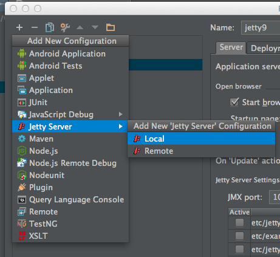
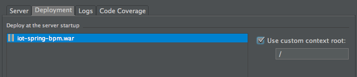
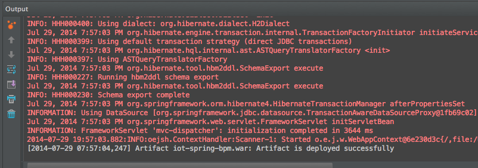

# Chapter 4

## Code segments

#####  Hibernate properties
```xml
<context:property-placeholder location="classpath:hibernate.properties" />
```

#####  Component scanning
```xml
<context:component-scan base-package="com.opitz.iotprototype" />
```

#####  Annotation driven settings, jackson hibernate compatibility
```xml
<mvc:annotation-driven>
        <mvc:message-converters>
            <!-- Use the HibernateAware mapper instead of the default -->
            <bean
                    class="org.springframework.http.converter.json.MappingJackson2HttpMessageConverter">
                <property name="objectMapper">
                    <bean class="com.opitz.iotprototype.utils.HibernateAwareObjectMapper" />
                </property>
            </bean>
        </mvc:message-converters>
    </mvc:annotation-driven>
	<mvc:default-servlet-handler />
```
    
    
#####  Database transactions manager
```xml
    <tx:annotation-driven />
    <bean id="transactionManager"
          class="org.springframework.orm.hibernate4.HibernateTransactionManager">
        <property name="sessionFactory" ref="sessionFactory"></property>
    </bean>

```

#####  Hibernate Configuration
```xml
   <bean id="sessionFactory"
          class="org.springframework.orm.hibernate4.LocalSessionFactoryBean">
        <property name="dataSource" ref="dataSource" />
        <property name="hibernateProperties">
            <props>
                <prop key="hibernate.hbm2ddl.auto">${hibernate.hbm2ddl.auto}</prop>
                <prop key="hibernate.dialect">${hibernate.dialect}</prop>
                <prop key="hibernate.default_schema">${hibernate.schema.name}</prop>
                <prop key="show_sql">${hibernate.show_sql}</prop>
                <prop key="format_sql">${hibernate.format_sql}</prop>
            </props>
        </property>
        <property name="packagesToScan">
            <list>
                <value>com.opitz.iotprototype.entities</value>
            </list>
        </property>
    </bean>
```

##### Spring Data Source configuration
```xml
    <bean id="dataSource"
          class="org.springframework.jdbc.datasource.TransactionAwareDataSourceProxy">
        <property name="targetDataSource">
            <bean class="org.springframework.jdbc.datasource.SimpleDriverDataSource">
                <property name="driverClass" value="${jdbc.driverClassName}" />
                <property name="url" value="${jdbc.url}" />
                <property name="username" value="${jdbc.user}" />
                <property name="password" value="${jdbc.pass}" />
            </bean>
        </property>
    </bean>

    <bean id="persistenceExceptionTranslationPostProcessor"
          class="org.springframework.dao.annotation.PersistenceExceptionTranslationPostProcessor" />
```

## Intellij Configuration




 



 


    