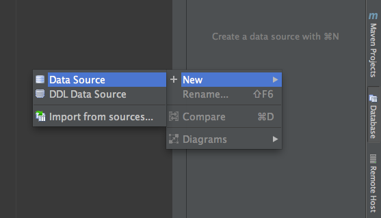
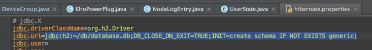

#section 5

##Adding a DB to IntelliJ
 
 

Use the URL from `hibernate.properties` in the URL field in the Data Source dialogue box. User and Password are empty


To create a timestamp for the `NodeLogEntry`

```java

@PrePersist
    protected void onPersist() {
        timestamp = new Date();
    }
    
```