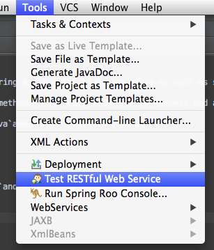
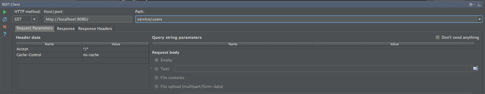
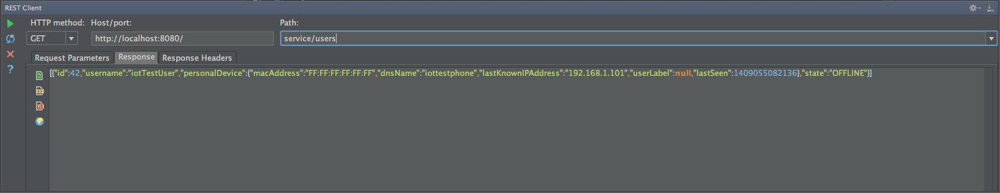
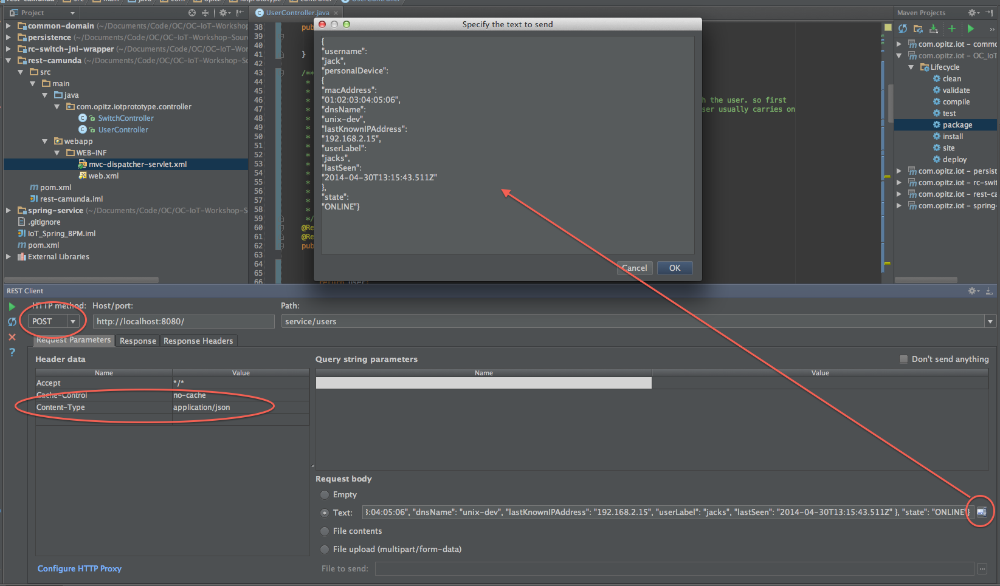

#section 6

## Testing a REST Service with IntelliJ

Open the Tool
 

Enter the path to your server and service you want to test
 

Hit play, see the response

Trying to add a new user? Try it like this
 
You need to use the POST http method. You need to specify the content type as json so the server knows what to expect. You also need to send the user you want to add as the body of the request (the json in the upper window).