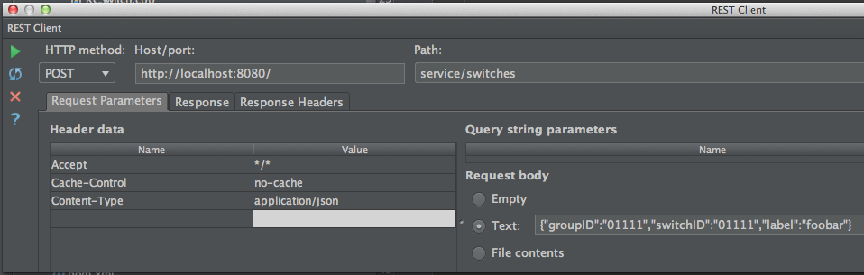
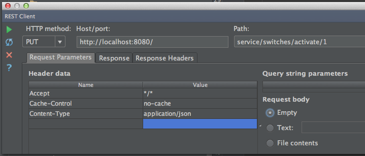

# section 7

* Use the `@Autowired` annotation to inject a Spring annotated class into another one. 
* Always inject the interface, spring will find the corresponding implementing class

add a plug like this:
 

Control a plug like this:
